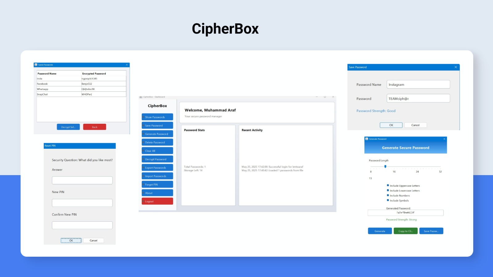

# 🔐 CipherBox - Secure Password Manager



**CipherBox** is a simple and secure desktop password manager that allows users to save, encrypt, decrypt, and manage their passwords with ease. It comes with built-in secure password generation and user-friendly features like import/export and PIN reset.

---

##  Features

-  **Password Encryption** – All passwords are securely encrypted.
-  **Save Passwords** – Store passwords with custom names.
-  **Show & Decrypt** – View encrypted passwords securely.
-  **Generate Strong Passwords** – Use the password generator with customization options.
-  **Export & Import Passwords** – Backup and restore passwords with ease.
-  **Reset PIN** – Recover access via a security question.
-  **Dashboard Stats** – View password count and activity log.
-  **Clear All & Delete Individual Passwords**

---

##  User Interface Overview

The UI includes:
- **Main Dashboard** with password stats and recent activity
- **Password list** with encryption details
- **Save Password** popup
- **Secure Password Generator** with strength indicator
- **Reset PIN** dialog

---

##  Technologies Used

- **Java** (Swing for GUI)
- **File I/O**
- **AES Encryption**
- **Password Strength Analysis**

---

## 🛠️ How to Run

1. Clone the repository:
   ```bash
   git clone https://github.com/muhammad-araf/CipherBox.git
